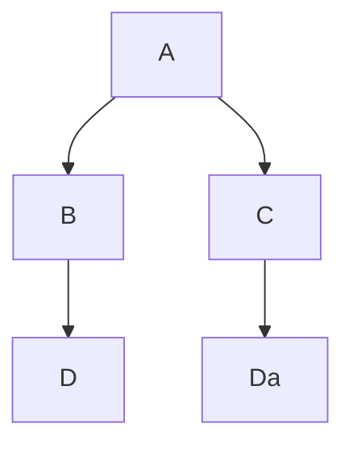

# Some technical thoughts on processing MEI sources to facilitate their scholarly semantic annotation

## The infratructure 

### What are the components?

- A REST service developped with [FastAPI](https://fastapi.tiangolo.com/).

### How to test it?

1. Fetch Apache Fuseki Docker by running this script: `./init-fuseki-docker.sh`
2. `docker-compose up --build`

### Links that can be useful

- https://jena.apache.org/documentation/fuseki2/fuseki-docker.html

