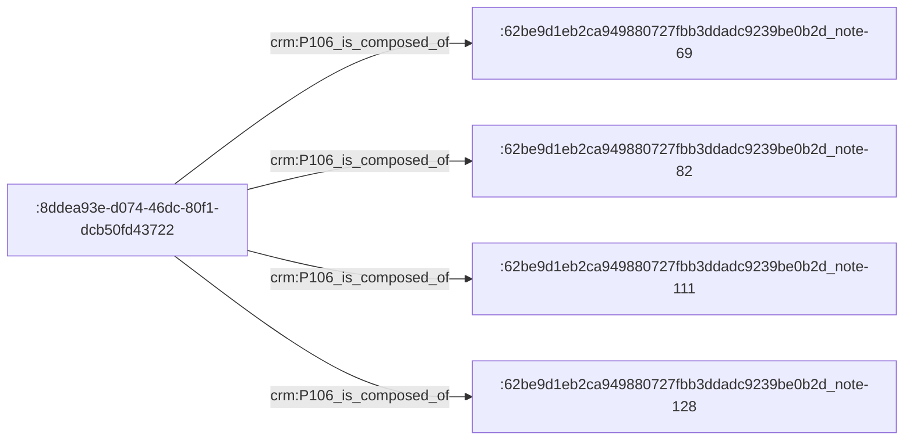

# Some technical thoughts on processing MEI sources to facilitate their future scholarly semantic annotation

__TOC__

## S C I E N T I F I C   G O A L S

To support modal & tonal analysis, which implies (at least) two functional prerequisites regarding the addressability of MEI elements:

- **PREREQUISITE 1 —** The possibility to address arbitrary sets of MEI elements that do not necessarily follow the logical organization of the MEI file structure. _For example: groupings of notes which forms a relevant observable on the musicological level but they are disjointed in the MEI XML structure._
- **PREREQUISITE 2 —** The possibility to address "verticalities" (musical offsets expressed in rhythmic values), for example to annotate the score with fundamentals that have been identified by the analysts. These verticalities are not materialized in the MEI encoding.

 

Since the question we are trying to answer here is: _"How to create anchors in MEI documents that are relevant to musicological analysis?"_, and since we are trying to answer it in the LOD paradigm, this work is related to other ongoing reflections, approaches & tools:

- The [MEI Linked Data Interest Group](https://music-encoding.org/community/interest-groups.html)
- [SPARQL-Anything](https://github.com/SPARQL-Anything/sparql.anything)
- [MIDI Linked Data](https://midi-ld.github.io/)
- Thoughts on non-trivial addressing of fragments in online documents
- Semantic modeling of annotation anchors related aspects
- _Aspects related to score edition_ vs. _aspects related to score annotation_
- _Encoding of musical sources_ vs. _musical meaning_
- …

--- 

## T E C H N I C A L   A N A L Y S I S

### PREREQUISITE 1 implications & decisions

The addressability of arbitrary sets of MEI elements implies that:

- each and every XML element in a MEI file should be identified by an unique IRI ;
- each and every arbitrary sets of elements should also be identified by an unique IRI, so as to provide anchors for scholarly annotations on the Web.

#### IRIs generation strategy for MEI XML elements

If each and every MEI XML element should receive its own IRI, then it would be convenient if they were uniquely identified within the file (for example with `xml:id`). We could then generate their IRIs based on their XML identifiers.

Thus, if we meet such an element in a MEI file:

`<note pname="g" oct="4" dur="8" dots="1"/>`

We should process the file so that it become something like:

`<note pname="g" oct="4" dur="8" dots="1" xml:id="note-69"/>`

(`69` is a random integer generated according to the order of occurrence of the element in the file)

The publication of data on the Web confronts us with another problem: the readability of IRIs. We propose to identify the input MEI file by its SHA1 (a cool and fast way to associate an unique ID to any bag of bytes). The full IRI of a MEI element thus become something like:

`http://example.com/62be9d1eb2ca949880727fbb3ddadc9239be0b2d_note-69`

(`62be9d1eb2ca949880727fbb3ddadc9239be0b2d` is the SHA1 of this [MEI file](https://github.com/music-encoding/sample-encodings/blob/master/MEI_4.0/Music/Complete_examples/Bach_Musikalisches_Opfer_Trio.mei))

The fact that `xml:id` contain the element tag name make the IRIs more usable. If the user is able to compute the SHA1 of his/her MEI file, and if the system publishes the processed MEI file which contains generated `xml:id`, then he/she is able to find the IRI of any MEI element. Of course, these IRIs are not really "human readable", but at least they do not "hide" the data behind arbitrary identifiers.

#### Arbitrary sets of MEI elements

Defining IRIs for MEI elements will alow any annotation tool to generate arbitrary sets as a new resources. An arbitrary set is linked to several MEI elements IRIs, and probably does not require more predicates:

Since the cardinality of a set is possibly important, we prefer to use abstract identifiers that do not reflect the content of the set (here, `:8ddea93e-d074-46dc-80f1-dcb50fd43722`).

Note: We rely on basic CIDOC-CRM properties when a general semantics is sufficient (as for example for non specific mereological relations).

We are currently developing an annotation tool which allows the creation of such sets by clicking on MEI notes in a [Verovio App](https://www.verovio.org/). More on this later in june.

### Document or semantic data?

### A few words about viewing & dereferencing IRIs

### Modeling, RDFizing & SPARQLing the score

### PREREQUISITE 2 implications & decisions

---

## T H E    I N F R A S T R U C T U R E

### What are the components and what are their technical roles?

- A REST service developped with [FastAPI](https://fastapi.tiangolo.com/), which processes an input MEI file with [lxml](https://lxml.de/) and [music21](https://web.mit.edu/music21/), and generates RDF data with [rdflib](https://rdflib.readthedocs.io/en/stable/).
- [Jena Fuseki](https://jena.apache.org/documentation/fuseki2/), which receives the aforementioned RDF data.
- [Apache](https://httpd.apache.org/), which statically hosts the aforementioned processed MEI file.
- [PostgreSQL](https://www.postgresql.org/), which is used as a cache system that stores unique UUID generated for RDF resources which creation results from the score analysis.

Everything works together thanks to some [docker-compose wizardry](docker-compose.yml).

### How to test it?

1. Fetch official Apache Fuseki Dockerfile by running this script: `./init-fuseki-docker.sh` (see: https://jena.apache.org/documentation/fuseki2/fuseki-docker.html)
2. `docker-compose up --build`
