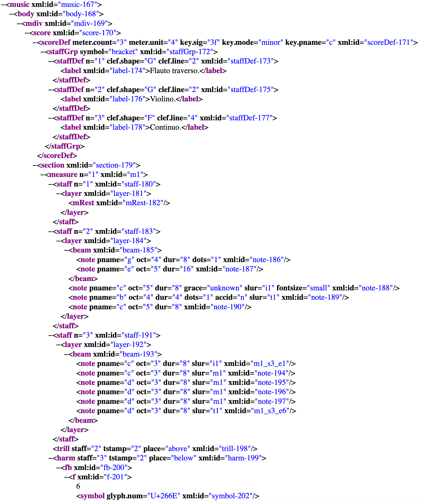
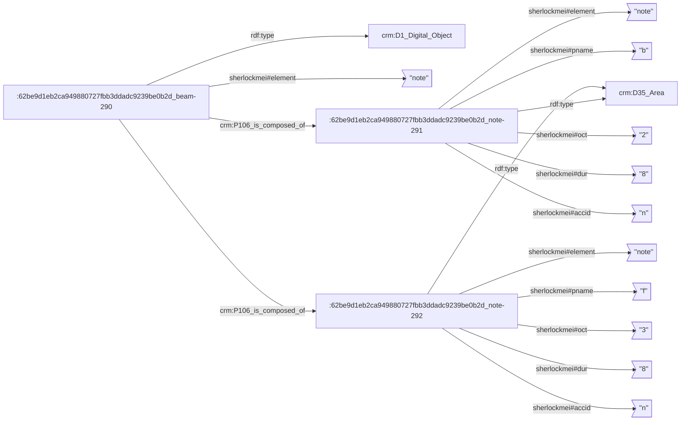
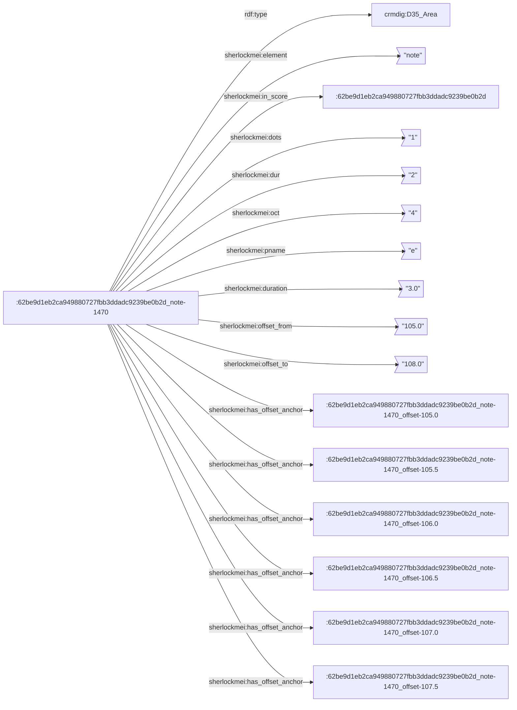
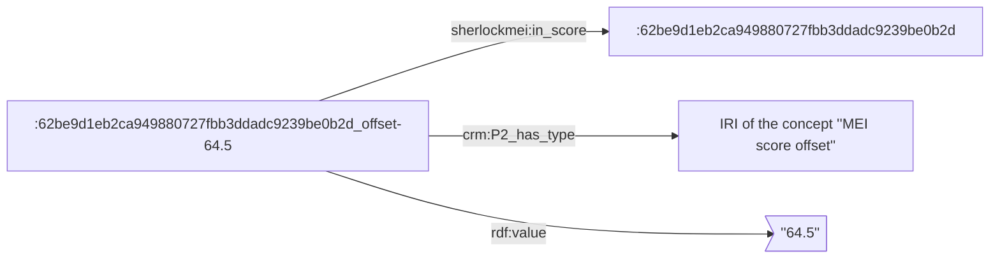
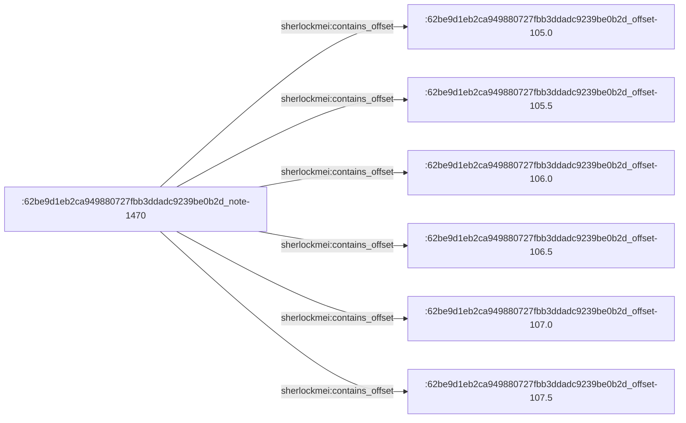

# Some technical thoughts on processing MEI sources to facilitate their future scholarly semantic annotation 🎼 + ⚓️ + 🌍

The ideas presented in this repository have bee initiated in the [Polymir project](https://www.iremus.cnrs.fr/fr/projets-de-recherche/polymir-polyphonic-music-information-retrieval) (_Polyphonic Music Information Retrieval_, lead by Achille Davy-Rigaux and Christophe Guillotel-Nothmann), currently actively developed in the [SHERLOCK project](https://www.iremus.cnrs.fr/fr/projets-de-recherche/sherlock-social-sciences-humanities-corpora-exploration-and-active-reading) (_Social sciences & Humanities corpora Exploration and active Reading with Linked, Open & Contributive Knowledge organisation systems_, lead by Achille Davy-Rigaux and Thomas Bottini) and also currently discussed in the [Polifonia project](https://polifonia-project.eu/).

*All that is presented here only makes sense in the perspective of offering MEI addressability foundations to future annotation tools. It's not really useful as is.*

## 🔭 S C I E N T I F I C   G O A L S

We want to support [modal & tonal analysis](https://polifonia-project.eu/pilots/tonalities/), which implies (at least) two functional prerequisites regarding the addressability of MEI elements:

- **PREREQUISITE 1 🎶 —** The possibility to address arbitrary sets of MEI elements that do not necessarily follow the logical organization of the MEI XML file structure. _For example: groupings of notes which forms a relevant observable on the musicological level but that are disjointed in the MEI XML structure._
- **PREREQUISITE 2 🥁 —** The possibility to address "verticalities" (musical offsets expressed in rhythmic values), for example to annotate the score with fundamentals that have been identified by the analysts. These verticalities are not materialized in the MEI encoding.

Since the question we are trying to answer here is: _"How to create anchors in MEI documents that are relevant to musicological analysis?"_, and since we are trying to answer it in the LOD paradigm, this work is the little sister of other ongoing reflections, approaches & tools:

- The [MEI Linked Data Interest Group](https://music-encoding.org/community/interest-groups.html)
- [SPARQL-Anything](https://github.com/SPARQL-Anything/sparql.anything)
- [MIDI Linked Data](https://midi-ld.github.io/)
- Thoughts on non-trivial addressing of fragments in online documents
- Semantic modeling of annotation anchors related aspects
- _Aspects related to score edition_ vs. _aspects related to score annotation_
- _Encoding of musical sources_ vs. _musical meaning_
- …

---

## ⚙️ T E C H N I C A L   A N A L Y S I S

### 🎶 PREREQUISITE 1 implications & decisions

The addressability of arbitrary sets of MEI elements implies that:

- each and every XML element in a MEI file should be identified by an unique IRI ;
- each and every arbitrary sets of elements should also be identified by an unique IRI, so as to provide anchors for scholarly annotations on the Web.

#### 🌍 IRIs generation strategy for MEI XML elements

If each and every MEI XML element should receive its own IRI, then it would be convenient if they were uniquely identified within the file (for example with `xml:id`). We could then generate their IRIs based on their XML identifiers.

Thus, if we meet such an element in a MEI file:

```xml
<note pname="g" oct="4" dur="8" dots="1"/>
```

We should process the file so that it become something like:

```xml
<note pname="g" oct="4" dur="8" dots="1" xml:id="note-69"/>
```

Note: `69` is a random integer generated according to the order of occurrence of the element in the file.

The publication of data on the Web confronts us with another problem: the readability of IRIs. We propose to identify the input MEI file by its SHA1 (a cool and fast way to associate an unique ID to any bag of bytes). The full IRI of a MEI element thus becomes something like:

`http://example.com/62be9d1eb2ca949880727fbb3ddadc9239be0b2d_note-69`

Note: `62be9d1eb2ca949880727fbb3ddadc9239be0b2d` is the SHA1 of this [MEI file](https://github.com/music-encoding/sample-encodings/blob/master/MEI_4.0/Music/Complete_examples/Bach_Musikalisches_Opfer_Trio.mei).

Note: The fact that `xml:id` contain the element tag name make the IRIs more usable. If the user is able to compute the SHA1 of her MEI file, and if the system publishes the processed MEI file which contains generated `xml:id`, then she is able to find the IRI of any MEI element. Of course, these IRIs are not really "human readable", but at least they do not "hide" the data behind arbitrary identifiers.

Let's finally take a brief look at a "xmlidized" MEI file:



#### 🎶 Arbitrary sets of MEI elements

Defining IRIs for MEI elements will alow any annotation graphical tool to generate arbitrary sets as a new resources. An arbitrary set is linked to several MEI elements IRIs (and probably does not require more predicates):


Note: Since the cardinality of a set is possibly important, we prefer to use abstract identifiers that do not reflect the content of the set (here, the set is identified by the IRI `http://example.com/8ddea93e-d074-46dc-80f1-dcb50fd43722`).

Note: We rely on basic CIDOC-CRM properties when a general semantics is sufficient (as for example for non specific mereological relations).

***We are currently developing an annotation tool which allows the creation of such sets by clicking on MEI notes in a [Verovio App](https://www.verovio.org/). More on this later in june.***

### 🎼 RDFizing the score

We talked about concepts that belong to separated worlds: IRIs are natives of the Web, and `xml:id` dwell in XML documents. We chose to represent any data or metadata produced about the content of a MEI score as a RDF dataset, and to store it in a triple store. We lose the autonomy of the MEI document, but having a SPARQL endpoint to access data is much more convenient for building rich JS clients.

Since we had to write an MEI file preprocessor to generate the identifiers, we also decided to take the opportunity to generate a full RDF equivalent of the XML structure. We rely on a very basic mapping strategy (see [sss/mei_sherlockizer.py](sss/mei_sherlockizer.py)), and rely on [CIDOC-CRM](http://www.cidoc-crm.org/sites/default/files/CIDOC%20CRM_v.7.1%20%5B8%20March%202021%5D.pdf) and [CRMdig](http://www.cidoc-crm.org/crmdig/sites/default/files/CRMdig_v3.2.1.pdf) for basic typing & structural relations between entities (non specific to music):

- Generic aspects related to digital structured contents:
  - The MEI score is a resource of type `crmdig:D1_Digital_Object` (a particular MEI file should also be a `lrmoo:F2_Expression`).
  - Each XML element is a resource of type `crmdig:D35_Area`.
  - Mereological relations between XML elements are mapped to the `crm:P106_is_composed_of` property.
- Specific aspects related to MEI:
  - We define ad-hoc predicates to represent MEI attributes: each "element/attribute/attribute value" pattern is mapped to a RDF triple. Our base prefix for predicates is `http://data-iremus.huma-num.fr/ns/sherlockmei#`. Tools like [SPARQL anything](https://github.com/SPARQL-Anything/sparql.anything) also need to create ad-hoc predicates to map the properties that are discovered in the sources (with `http://sparql.xyz/facade-x/data/` as base prefix for SPARQL anything).
  - The text content of a MEI XML node is connected to its resource through a `sherlockmei:text` predicate.
  - We chose to never, ever, use RDF blank nodes so as to make each and every piece of data addressable on the Web for annotation purpose (which we cannot predict yet).

All steps of the MEI preprocessor are commented in [sss/main.py](sss/main.py).

Let's have a look at some RDF data. The following MEI fragment:

```xml
<beam xml:id="beam-290">
    <note pname="b" oct="2" dur="8" accid="n" xml:id="note-291"/>
    <note pname="f" oct="3" dur="8" accid="n" xml:id="note-292"/>
    (...)
</beam>
```

will generate a RDF dataset which looks like:



***With this approach, we hope to preserve in a RDF dataset the totality of the data and relations that constitute the MEI score.***

TODO: have a closer look to [MIDI Linked Data](https://midi-ld.github.io/).

### 🥁 PREREQUISITE 2 implications & decisions

On the following measure, the E note should be associated to six annotation anchors, because it "crosses" six eighth notes throughout its duration:


These offsets are not materialized in the MEI score, and we have to extract them. Each of these six anchors should have its own IRI. [We use music21 to extract the offsets from the MEI content](sss/mei_offsets.py). Here is the kind of RDF data we generate (again, we try to forge readable IRIs):



Moreover, we need to extract all the offsets defined at the score level, so as to provide anchors for annotation that materialize fundamentals. Here is an overview of the RDF data that represent such a score offset:



We also weave a link between the note element and the global score offsets that are "contained" in its duration:



---

## 🌃 T H E    I N F R A S T R U C T U R E

### 🎛 What are the components and what are their technical roles?

- A REST service developped with [FastAPI](https://fastapi.tiangolo.com/), which processes an input MEI file with [lxml](https://lxml.de/) and [music21](https://web.mit.edu/music21/), and generates RDF data with [rdflib](https://rdflib.readthedocs.io/en/stable/).
- [Jena Fuseki](https://jena.apache.org/documentation/fuseki2/), which receives the aforementioned RDF data.
- [Apache](https://httpd.apache.org/), which statically hosts the aforementioned processed MEI file.
- [PostgreSQL](https://www.postgresql.org/), which is used as a cache system that stores unique UUID generated for RDF resources which creation results from the score analysis.

Everything works together thanks to some [docker-compose wizardry](docker-compose.yml).

### 🚀 How to boot it?

1. Fetch Fuseki Dockerfile by running this script: `./init-fuseki-docker.sh`
2. `docker-compose up --build`

### 🤗 How to use it?

#### Send a MEI file:

```bash
curl \
    -X POST \
    -d 'uri=https://raw.githubusercontent.com/music-encoding/sample-encodings/master/MEI_4.0/Music/Complete_examples/Bach_Musikalisches_Opfer_Trio.mei' \
    -H "Content-Type: application/x-www-form-urlencoded" \
    http://localhost:8000/sss/mei | jq
```

Here is the response:

```json
{
  "input_file_encoding": {
    "encoding": "utf-8",
    "confidence": 0.99,
    "language": ""
  },
  "input_file_sha1": "62be9d1eb2ca949880727fbb3ddadc9239be0b2d",
  "input_file_uri": "https://raw.githubusercontent.com/music-encoding/sample-encodings/master/MEI_4.0/Music/Complete_examples/Bach_Musikalisches_Opfer_Trio.mei",
  "sherlock_file_uri": "http://localhost:80/files/meiweb/62be9d1eb2ca949880727fbb3ddadc9239be0b2d_sherlockized.mei",
  "sherlock_score_uri": "http://localhost:3000/id/62be9d1eb2ca949880727fbb3ddadc9239be0b2d"
}
```

- `input_file_encoding`: some information about the encoding of the submitted MEI file, computed by [chardet](https://github.com/chardet/chardet)
- `input_file_sha1`: the SHA1 of the submitted MEI file
- `input_file_uri`: the submitted file URI
- `sherlock_file_uri`: the URL at which the processed MEI file is published
- `sherlock_score_uri`: the URL at which the MEI file can be viewed in a rich client (TODO)

#### SPARQLing the score

How many triples have been generated and stored in Fuseki?

```bash
curl --data-urlencode "query=SELECT ?g (COUNT(*) as ?triples) WHERE { GRAPH ?g { ?s ?p ?o } } GROUP BY ?g" http://localhost:3030/ds/sparql
```

Count pitches:

```bash
curl --data-urlencode "query=SELECT ?pitch (COUNT(*) as ?count) WHERE { GRAPH ?g { ?s <http://data-iremus.huma-num.fr/ns/sherlockmei#pname> ?pitch } } GROUP BY ?pitch" http://localhost:3030/ds/sparql
```

Display voices names:

```bash
  curl --data-urlencode "query= \
  PREFIX crm: <http://www.cidoc-crm.org/cidoc-crm/> \
  PREFIX sherlockmei: <http://data-iremus.huma-num.fr/ns/sherlockmei#> \
  SELECT ?label_value WHERE { GRAPH ?g { \
    ?music sherlockmei:element 'music' . \
    ?music crm:P106_is_composed_of+ ?staffDef . \
    ?staffDef sherlockmei:element 'staffDef' . \
    ?staffDef crm:P106_is_composed_of ?label . \
    ?label sherlockmei:element 'label' . \
    ?label sherlockmei:text ?label_value . \
  } }" http://localhost:3030/ds/sparql
```

Get all score offsets:

```bash
curl --data-urlencode "query= \
  PREFIX crm: <http://www.cidoc-crm.org/cidoc-crm/> \
  PREFIX iremus: <http://data-iremus.huma-num.fr/id/> \
  PREFIX sherlockmei: <http://data-iremus.huma-num.fr/ns/sherlockmei#> \
  PREFIX rdf: <http://www.w3.org/1999/02/22-rdf-syntax-ns#> \
  SELECT * \
  WHERE { \
    GRAPH <http://data-iremus.huma-num.fr/graph/meiweb> { \
      ?offset sherlockmei:in_score iremus:62be9d1eb2ca949880727fbb3ddadc9239be0b2d . \
      ?offset crm:P2_has_type iremus:90a2ae1e-0fbc-4357-ac8a-b4b3f2a06e86 . \
      ?offset rdf:value ?value . \
    } \
  } \
  " http://localhost:3030/ds/sparql
```

Note: `iremus:90a2ae1e-0fbc-4357-ac8a-b4b3f2a06e86`is the IRI of the concept "MEI score offset"

🎉 Querying score offsets is cool when you want to extract the rhythmic structure of a score and map it to triggers inputs of a drum machine, in the perspective of remixing music heritage with electronic music technologies.